# Deep Research Feature Improvements

```mermaid
%%{init: {'theme': 'default', 'flowchart': {'nodeSpacing': 50, 'rankSpacing': 70}, 'themeVariables': {'fontSize': '16px', 'nodeBorder': '2px'}  }%%
graph TD
  A[Deep Research Feature] --> B[Current Implementation]
  A --> C[Proposed Improvements]
  
  C --> D[Low-Token Representation]
  C --> E[Quality Improvements]
  C --> F[Quantity Improvements]
  C --> G[UX Improvements]
  
  D --> D1[Tiered Result Format]
  D --> D2[Progressive Loading]
  D --> D3[Vector Embedding Compression]
  
  E --> E1[Enhanced Relevance Scoring]
  E --> E2[LLM-Guided Query Expansion]
  E --> E3[Source Evaluation]
  
  F --> F1[Parallel Optimizations]
  F --> F2[Caching System]
  F --> F3[Research Horizon Expansion]
  
  G --> G1[Interactive Dashboard]
  G --> G2[Progress Reporting]
  G --> G3[Natural Language Interface]
  
  H[Implementation with VS Code Copilot] --> H1[Sidebar Interface]
  H --> H2[Code Generation]
  H --> H3[Edit Refinement]
  
  subgraph "Tiered Result Format Details"
    D1 --> D1A[Compact Mode]
    D1 --> D1B[Summary Mode]
    D1 --> D1C[Full Mode]
  end
  
  subgraph "Implementation Process"
    H2 --> I1[Generate Component Code]
    I1 --> I2[Review & Test]
    I2 --> I3[Refine with Copilot Edit]
  end
  
  style A fill:#f9f,stroke:#333,stroke-width:5px
  style C fill:#bbf,stroke:#333,stroke-width:5px
  style D fill:#bfb,stroke:#333,stroke-width:5px
  style E fill:#bfb,stroke:#333,stroke-width:5px
  style F fill:#bfb,stroke:#333,stroke-width:5px
  style G fill:#bfb,stroke:#333,stroke-width:5px
  style H fill:#fbf,stroke:#333,stroke-width:5px
  
  classDef default fontSize:14px,fontWeight:bold
  classDef big fontSize:16px,fontWeight:bold
  class A,B,C,D,E,F,G,H big
```

## Current Implementation Analysis

The current DeepResearcher implementation provides a recursive search capability that:
- Generates subqueries from an initial query
- Explores these queries to a configurable depth
- Uses a relevance threshold to prune irrelevant paths
- Extracts key findings and evidence
- Handles timeouts and parallel execution
- Returns a rich JSON result structure with findings and metadata

## Proposed Improvements

### 1. Low-Token Representation of Research Results

Currently, the research results are returned in a high-token JSON format containing all findings, evidence, and metadata. This can be inefficient for token-limited LLM contexts. Proposed improvements:

#### 1.1 Tiered Result Format

Implement multiple result formats that can be selected based on needs:

- **Compact Mode**: A minimalist representation that includes only:
  ```json
  {
  "query": "original query",
  "key_conclusions": ["Finding 1", "Finding 2", "Finding 3"],
  "confidence": 0.85,
  "sources_count": 12
  }
  ```

- **Summary Mode**: A moderately detailed format:
  ```json
  {
  "query": "original query",
  "key_findings": [
    {"finding": "Finding 1", "confidence": 0.9},
    {"finding": "Finding 2", "confidence": 0.8}
  ],
  "evidence_summary": "Brief synthesis of supporting evidence",
  "exploration_stats": {
    "depth": 3,
    "paths_explored": 12,
    "total_time": 5.2
  }
  }
  ```

- **Full Mode**: The current comprehensive format with all details

#### 1.2 Progressive Loading

Implement a mechanism to load research results progressively:
- Initially return the compact representation
- Allow requesting more details on specific findings
- Support pagination of research paths and evidence

#### 1.3 Vector Embedding Compression

- Generate vector embeddings for findings and evidence
- Store these embeddings for efficient semantic retrieval
- Return clustered findings based on semantic similarity to reduce redundancy

### 2. Improving Research Quality

#### 2.1 Enhanced Relevance Scoring

- Implement semantic similarity metrics using embeddings to better determine relevance
- Consider context-specific relevance scoring based on domain knowledge
- Add adaptive thresholds that adjust based on the query domain

#### 2.2 LLM-Guided Query Expansion

- Integrate with QueryExpander for more intelligent subquery generation
- Use an LLM to evaluate the potential value of a query path before exploration
- Implement A* search algorithm for exploration with heuristic-guided path selection

#### 2.3 Source Evaluation and Verification

- Add source credibility assessment
- Implement cross-verification of findings across multiple sources
- Add confidence scoring based on source consensus

### 3. Improving Research Quantity

#### 3.1 Parallel Exploration Optimizations

- Implement work-stealing thread pool for more efficient parallel exploration
- Add adaptive worker scaling based on system load and query complexity
- Integrate early stopping for clearly irrelevant paths

#### 3.2 Caching and Persistence

- Implement a tiered caching system for research results
- Store partial research results for interrupted sessions
- Add incremental research capability that builds on previous findings

#### 3.3 Research Horizon Expansion

- Implement broader initial query expansion to cover more potential areas
- Add domain-specific search templates for different knowledge domains
- Support "drill-down" and "zoom-out" exploration modes for breadth vs. depth

### 4. User Experience Improvements

#### 4.1 Interactive Research Dashboard

- Develop a visual interface to show the research tree in real-time
- Allow users to guide the research by selecting promising paths
- Provide interactive filtering of results by relevance, source type, etc.

#### 4.2 Progress Reporting

- Add streaming updates during long-running research
- Implement configurable progress callbacks
- Display time estimates based on exploration complexity

#### 4.3 Natural Language Interface

- Accept natural language research goals
- Translate research findings into conversational responses
- Support follow-up questions about specific findings

## Implementation Plan using VS Code Copilot

To implement these improvements, we can use VS Code Copilot with the following approach:

1. Open the Copilot sidebar (Ctrl+Alt+B)
2. Start by discussing the overall architecture for the improved feature
3. Generate implementations for specific components:

   ```
   I need help implementing a tiered result format system in Python for the DeepResearcher class.
   
   The code should include:
   - A ResultFormat enum for different output modes (COMPACT, SUMMARY, FULL)
   - A formatter class that converts ResearchResult objects to the appropriate format
   - Methods to progressively request more detailed information
   
   Please make the solution efficient, maintainable, and compatible with the existing DeepResearcher class.
   ```

4. Request specific enhancements for each major feature
5. Test implementations incrementally
6. Refine the code through the Copilot edit interface (Ctrl+Alt+H)

This implementation strategy leverages Copilot's strengths in generating code while maintaining human guidance for the overall architecture and design decisions.
