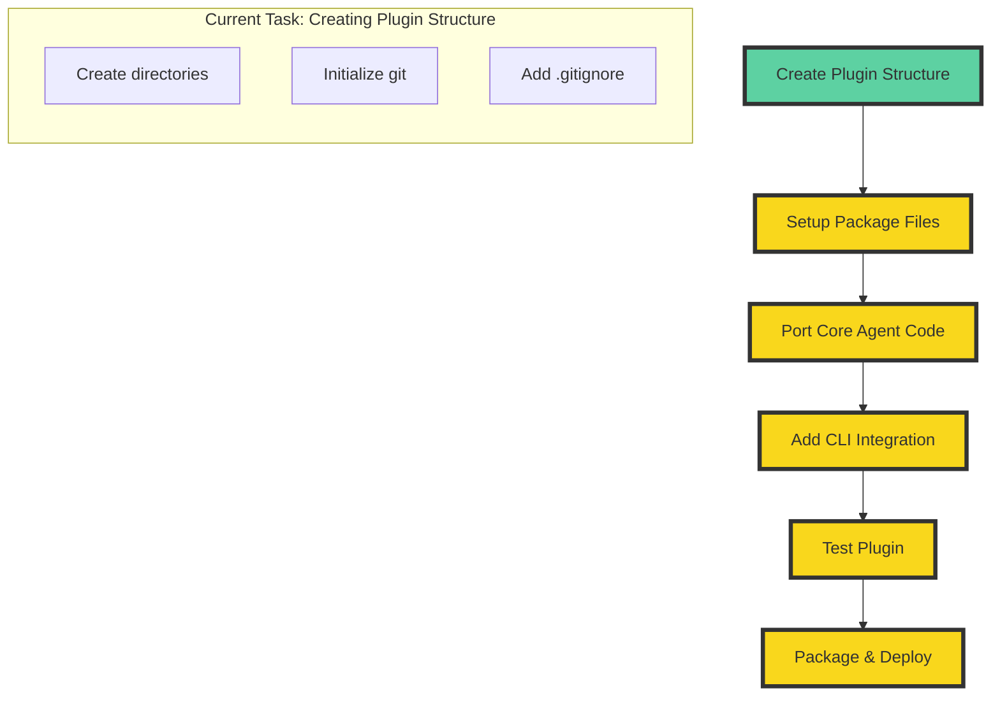

# LLM Agent Plugin Development Progress

```mermaid
flowchart TD
    classDef notStarted fill:#f9d71c,stroke:#333,stroke-width:4px
    classDef inProgress fill:#5dd1a2,stroke:#333,stroke-width:4px
    classDef completed fill:#87CEFA,stroke:#333,stroke-width:4px

    A["Create Plugin Structure"]:::inProgress
    B["Setup Package Files"]:::notStarted
    C["Port Core Agent Code"]:::notStarted
    D["Add CLI Integration"]:::notStarted
    E["Test Plugin"]:::notStarted
    F["Package & Deploy"]:::notStarted

    A --> B
    B --> C
    C --> D 
    D --> E
    E --> F

    subgraph Current["Current Task: Creating Plugin Structure"]
        direction TB
        1["Create directories"]
        2["Initialize git"]
        3["Add .gitignore"]
    end
```
