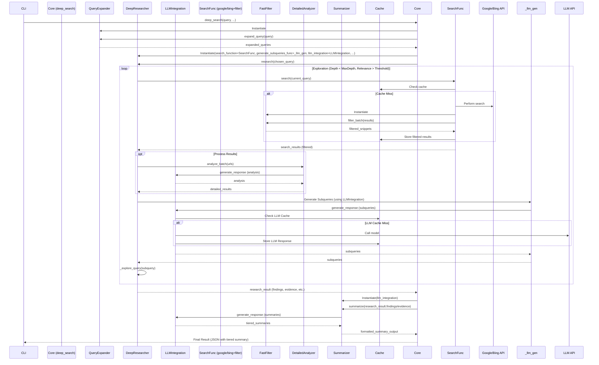

# Deep Search Architecture Diagram

## Task Progress Visualization
## Implementation Tasks Progress

- [x] 1. Implement LLM-Powered Subquery Generation
- [x] 2. Instantiate and Pass LLMIntegration
- [x] 3. Refactor Existing LLM Calls
- [x] 4. Provide LLMIntegration to DeepResearcher
- [x] 5. Remove cache.py
- [x] 6. Consolidate Caching on diskcache
- [x] 7. Integrate QueryExpander
- [x] 8. Integrate FastFilter
- [x] 9. Integrate DetailedAnalyzer
- [x] 10. Integrate Summarizer
- [x] 11. Refactor __init__.py
- [x] 12. Improve Relevance & Pruning
- [x] 13. Visualize Target Architecture
- [x] 14. Write Integration Tests
- [x] 15. Update Existing Tests

**Status:** All implementation tasks completed.
