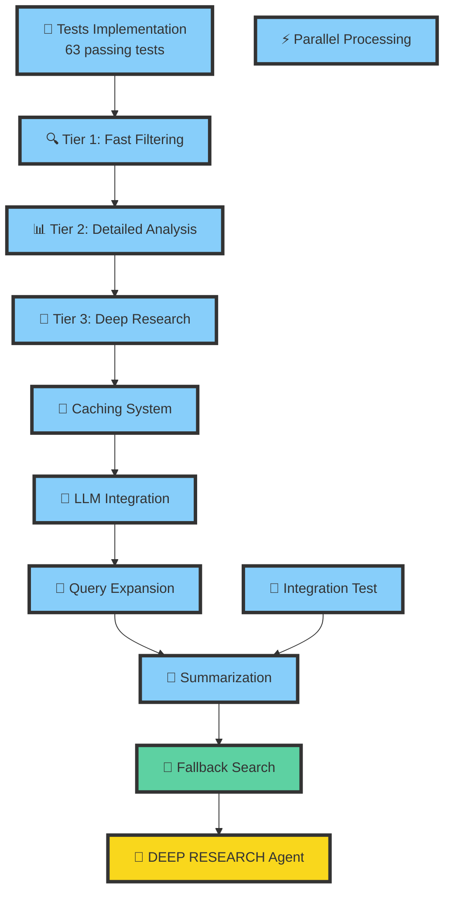

# LLM Search Development Progress

## Current Task Status

## Implementation Status

### ✅ Completed Features
1.  **Test Suite (63 passing tests)**
    *   Unit tests for all components
    *   Integration tests
    *   Performance tests
    *   Thread safety tests
    *   Error handling tests

2.  **Core Components**
    *   Fast Filtering (Tier 1)
    *   Detailed Analysis (Tier 2)
    *   Deep Research (Tier 3)
    *   Parallel Processing
    *   Caching System
    *   LLM Integration
    *   Query Expansion
    *   Summarization System

3. **Summarization System**
    * Multi-level summaries (short, medium, long)
    * Key insights extraction
    * Content combination for hierarchical summarization
    * LLM integration for summary generation
    * Mock implementation for testing without LLM dependency
    * Error Handling (for LLM failures)
    * Time tracking for performance measurement

### 🔄 In Progress
1. **Fallback Search**
   - Designing alternative search strategies

### 📋 Next Steps
1. **Fallback Search Implementation**
   - Alternative search paths
   - Error recovery
   - Source diversification

2. **DEEP RESEARCH Agent**
   - Autonomous exploration
   - Self-guided research
   - Learning from feedback

Would you like me to move on to implementing the Fallback Search functionality?
